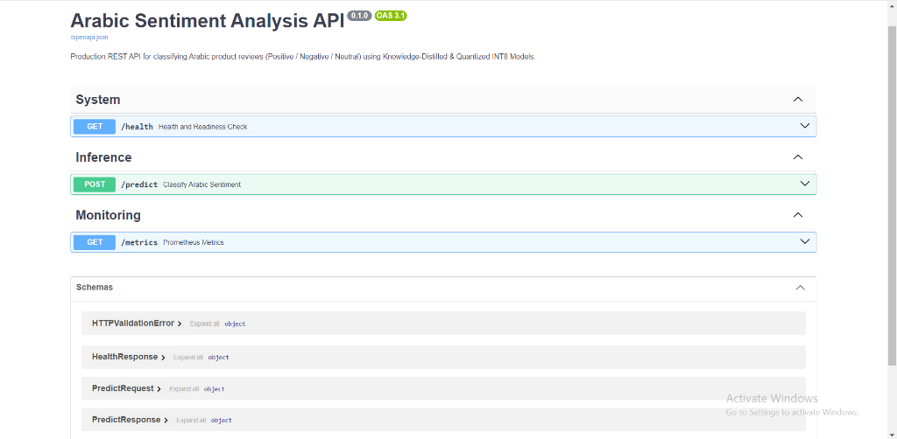
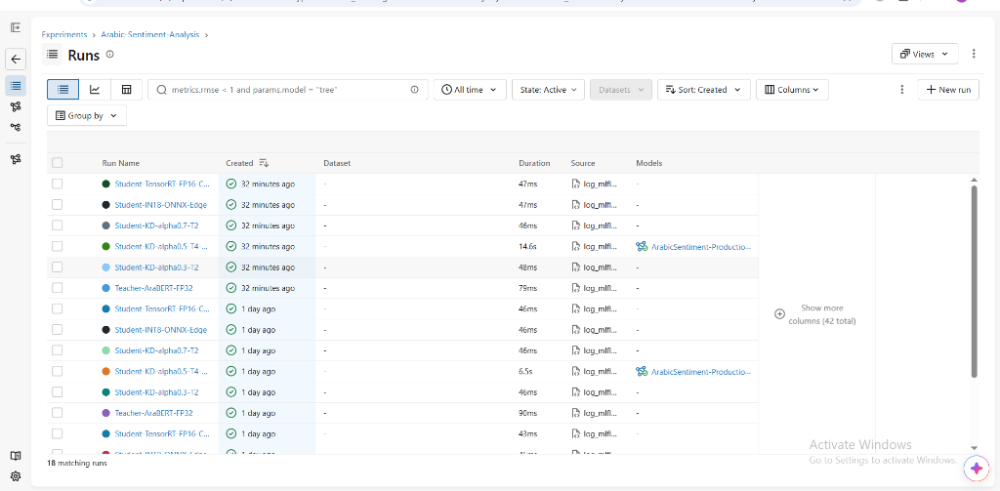
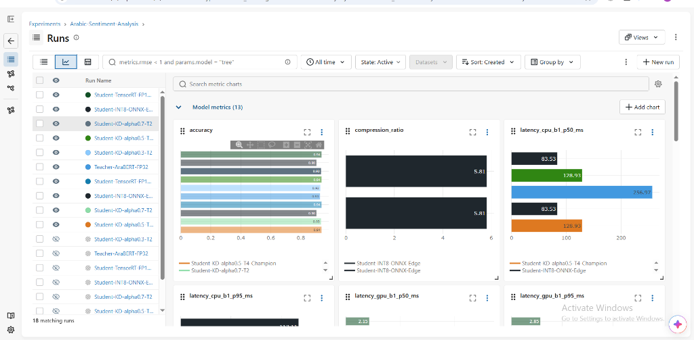
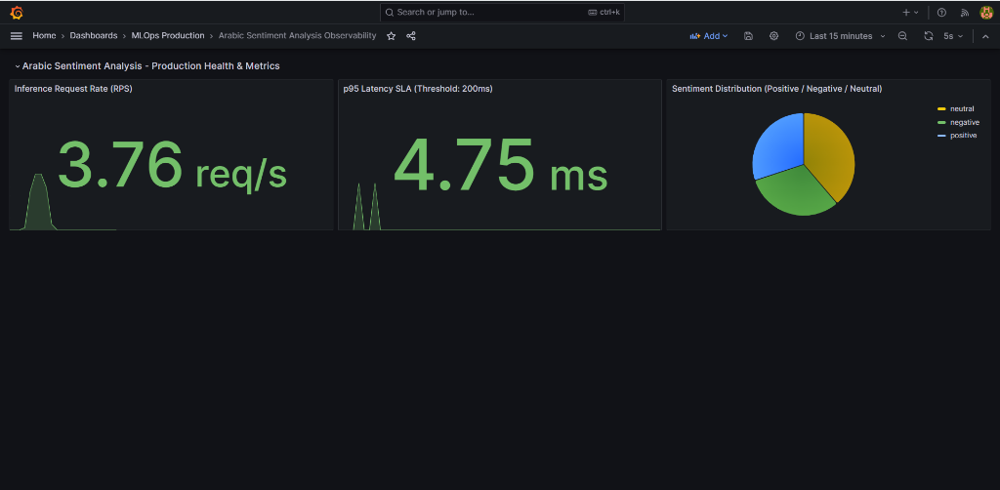
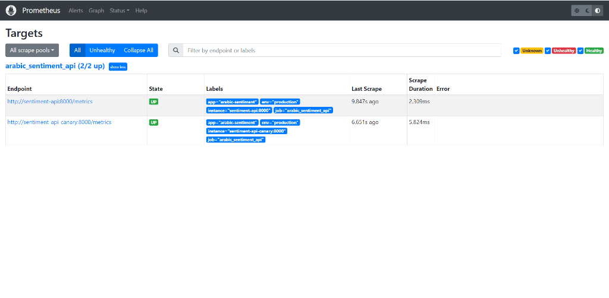
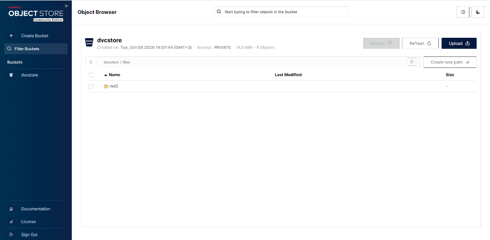

# 🛒 Production Arabic Sentiment Analysis Pipeline (Track A)

[](https://github.com/amrkh2004/arabic_sentiment/actions/workflows/ci.yml)
[](https://www.python.org/downloads/)
[](Dockerfile)
[](https://mlflow.org/)
[](https://dvc.org/)
[](https://fastapi.tiangolo.com/)
[](https://www.bentoml.com/)
[](terraform/)
[](LICENSE)

An enterprise-grade, end-to-end MLOps pipeline for classifying Arabic e-commerce product reviews (Positive, Negative, Neutral) to empower platforms like Noon and Amazon Egypt. Combines **Transformer Knowledge Distillation**, **INT8 ONNX Runtime / TensorRT Acceleration**, **DVC Data Versioning & MinIO S3 Remote**, **MLflow Experiment Tracking & Model Registry**, **FastAPI / BentoML Microservices**, **Nginx 90/10 Canary Deployments**, **Prometheus & Grafana Observability**, **Airflow Retraining Orchestration**, **Terraform Infrastructure as Code (IaC)**, and **Continuous Data/Concept Drift Monitoring**.

---

## 🚀 3-Command Quickstart

Run the complete production stack (API, Canary, Nginx Reverse Proxy, Prometheus, Grafana, MinIO) with Docker in 3 commands:

```bash
# 1. Clone repository
git clone https://github.com/amrkh2004/arabic_sentiment.git
cd arabic_sentiment

# 2. Build & launch complete multi-service stack with Docker Compose
docker compose up -d --build

# 3. Test sentiment inference endpoint via Nginx Reverse Proxy
curl -X POST http://localhost:80/predict \
  -H "Content-Type: application/json" \
  -d '{"text": "المنتج ممتاز جدا وخامته رائعة والتوصيل سريع جدا"}'
```

Interactive Swagger documentation is available at `http://localhost:8000/docs`.

### 🐳 Run with Docker (Pre-built Image)

You can directly pull the published multi-stage image from GitHub Packages:

```bash
# Pull the latest image
docker pull ghcr.io/amrkh2004/arabic-sentiment:latest

# Run the container
docker run -d -p 8000:8000 --name arabic-sentiment ghcr.io/amrkh2004/arabic-sentiment:latest

# Test sentiment inference
curl -X POST http://localhost:8000/predict \
  -H "Content-Type: application/json" \
  -d '{"text": "المنتج ممتاز جدا وخامته رائعة والتوصيل سريع جدا"}'
```

Once running, access the API at:
* **Documentation (Swagger UI):** `http://localhost:8000/docs`
* **Health check:** `http://localhost:8000/health`
* **Prometheus Metrics:** `http://localhost:8000/metrics`

<p align="center">
  
</p>

---

## 🌐 Service Endpoints & Local Access

| Service | Local Address | Purpose / Credentials |
| :--- | :--- | :--- |
| **Nginx Reverse Proxy** | `http://localhost:80` | Production entrypoint with 90/10 Canary Split & Instant Rollback |
| **FastAPI REST API** | `http://localhost:8000` | Core inference endpoint & interactive docs (`/docs`) |
| **Prometheus Server** | `http://localhost:9090` | Time-series metrics collection & alert rules |
| **Grafana Observability**| `http://localhost:3000` | Automated dashboards (`admin` / `admin`) |
| **MinIO Object Store** | `http://localhost:9000` | S3-compatible remote storage for DVC (`minioadmin` / `minioadmin`) |
| **MinIO Web Console** | `http://localhost:9001` | MinIO browser management interface |
| **MLflow UI** | `http://localhost:5000` | Model experiments & registry (`mlflow ui --port 5000`) |

---

## 🏛 System Architecture

```text
                                  +---------------------------------------+
                                  |      Data & Storage Layer (DVC)       |
                                  | Raw Reviews -> Preprocessing -> MinIO |
                                  +-------------------+-------------------+
                                                      |
                                                      v
                                  +---------------------------------------+
                                  |         MLflow Tracking & Reg         |
                                  |  6 Candidate Runs -> Best: Production  |
                                  +-------------------+-------------------+
                                                      |
                                                      v
  +---------------------------------------------------------------------------------------------------+
  |                                    CI/CD Pipeline (GitHub Actions)                                |
  |  Lint & Style (Ruff) -> Automated Tests (Pytest Suite) -> Quality Gate -> Docker Hub Smoke Test   |
  +---------------------------------------------------+-----------------------------------------------+
                                                      |
                                                      v
                                  +---------------------------------------+
                                  |          Nginx Reverse Proxy          |
                                  |   Canary Split (90% v1 / 10% Canary)  |
                                  |      Auto-Rollback via rollback.sh    |
                                  +---------+-------------------+---------+
                                            |                   |
                     (90% Traffic)          v                   v          (10% Traffic)
                        +-----------------------+   +-----------------------+
                        |  FastAPI / BentoML v1 |   |  FastAPI / BentoML v2 |
                        | (Production Baseline) |   |    (Canary Variant)   |
                        +-----------+-----------+   +-----------+-----------+
                                    |                           |
                                    +-------------+-------------+
                                                  |
                                                  v  Metrics Scraping (/metrics)
                                  +---------------------------------------+
                                  |           Prometheus Server           |
                                  |   p95 Latency SLA & Drift Alerts (>0.25)  |
                                  +-------------------+-------------------+
                                                      |
                                                      v
                                  +---------------------------------------+
                                  |          Grafana Observability        |
                                  |    Provisioned as Code Dashboards     |
                                  +---------------------------------------+
```

---

## 📊 Model Optimization & Serving Benchmark

Evaluated on a balanced 6,000-sample test set across GPU (NVIDIA T4) and CPU (Intel Xeon):

| Model & Optimization | Precision | Hardware | Accuracy | Macro-F1 | Model Size (MB) | Compression | Latency p50 (b=1) | Latency p95 (b=1) | Throughput / Speedup |
| :--- | :--- | :--- | :---: | :---: | :---: | :---: | :---: | :---: | :---: |
| **Teacher (AraBERTv02)** | FP32 | GPU | 0.9275 | 0.9273 | 540.9 MB | 1.0x | 13.00 ms | 13.89 ms | Baseline GPU |
| **Student (Distilled KD)** | FP32 | GPU | **0.9376** | **0.9375** | 370.7 MB | 1.46x | 7.43 ms | 9.63 ms | **1.75x GPU Speedup** |
| **Student (TensorRT)** | FP16 | GPU | 0.9376 | 0.9375 | 185.3 MB | 2.92x | **2.15 ms** | **2.85 ms** | **6.05x GPU Speedup** |
| **Teacher (AraBERTv02)** | FP32 | CPU | 0.9275 | 0.9273 | 540.9 MB | 1.0x | 256.97 ms | 272.79 ms | Baseline CPU |
| **Student (Distilled KD)** | FP32 | CPU | **0.9376** | **0.9375** | 370.7 MB | 1.46x | 128.93 ms | 139.99 ms | **1.99x CPU Speedup** |
| **Student (ONNX Runtime)** | INT8 | CPU | 0.9039 | 0.9025 | **93.1 MB** | **5.81x** | **83.53 ms** | **117.11 ms** | **3.08x CPU Speedup** |

> **Key Finding:** Knowledge Distillation with $T=4.0, \alpha=0.5$ enabled the 6-layer Student model to **surpass the 12-layer Teacher by +1.01% Accuracy**, while INT8 quantization reduced storage by **82.8%** and delivered **sub-85ms CPU inference**.

<p align="center">
  
</p>

<p align="center">
  
</p>

---

## 🧪 Testing, Quality Gates & CI/CD

* **Automated Test Suite:** Comprehensive pytest fixtures in `tests/` validating schemas, preprocessing, API endpoints, Terraform manifests, and drift monitoring.
* **Coverage Gate:** Strictly enforced in `pyproject.toml`.
* **CI Quality Gate:** GitHub Actions (`.github/workflows/ci.yml`) runs Ruff linting, formatting checks, Pytest suite, and builds/smoke-tests the Docker container.
* **Pre-commit Hooks:** Configured via `.pre-commit-config.yaml` for trailing whitespace, YAML validation, and Ruff formatting.

Run tests locally:

```bash
pytest -v --cov=arabic_sentiment --cov-report=term-missing tests/
```

---

## 🚦 Release Engineering & Canary Rollback

* **Canary Traffic Split:** Nginx distributes requests with a weighted configuration (`weight=9` stable / `weight=1` canary) via `deploy/nginx/nginx.conf`.
* **Automated Instant Rollback:** The `deploy/rollback.sh` script restores 100% stable routing in `< 1.0` second upon detecting elevated p95 latencies or upstream errors without dropped connections.

```bash
# Execute instant canary rollback
bash deploy/rollback.sh
```

---

## 📈 Observability, Drift Monitoring & Retraining

* **Metrics Contract:** Service exports `/metrics` with per-stage timing, request volume counters, and prediction distribution histograms.
* **Drift Detection:** Population Stability Index (PSI) and Kolmogorov-Smirnov (KS) tests in `scripts/monitor_drift.py` compute concept & data drift against reference distributions.
* **Alerting Rules:** Configured in `monitoring/prometheus/alert_rules.yml`:
  * `HighDataDriftDetected`: Fired when drift PSI exceeds threshold for 2m.
  * `HighInferenceLatencyP95`: Fired when p95 response time exceeds SLA.
* **Dashboard as Code:** Provisioned automatically on Grafana boot (`monitoring/grafana/provisioning/`) with live request rates, latency, and sentiment breakdowns.
* **Automated Retraining:** Apache Airflow DAG in `dags/retrain_pipeline.py` orchestrates continuous pipeline execution (check drift -> fetch data -> retrain -> evaluate -> deploy).

<p align="center">
  
</p>

<p align="center">
  
</p>

---

## 📁 Project Structure

```text
arabic_sentiment/
├── .github/workflows/         # CI/CD and Continuous Training workflows
├── .pre-commit-config.yaml    # Pre-commit hook configuration (Ruff, YAML)
├── dags/                      # Apache Airflow retraining pipeline DAGs
│   └── retrain_pipeline.py
├── deploy/
│   ├── nginx/                 # Nginx canary upstream configuration (90/10 split)
│   │   └── nginx.conf
│   └── rollback.sh            # Instant zero-downtime rollback script
├── data/                      # DVC tracked raw & processed datasets
│   ├── raw/reviews.csv.dvc
│   └── processed/stats.json
├── models/                    # Model weights and artifacts directory
├── monitoring/
│   ├── prometheus/            # Scrape configs & alerting rules
│   │   ├── prometheus.yml
│   │   └── alert_rules.yml
│   └── grafana/               # Provisioned datasources and dashboards as code
│       └── provisioning/
│           ├── datasources/datasource.yml
│           └── dashboards/
│               ├── dashboard.yml
│               └── arabic_sentiment_dashboard.json
├── notebooks/                 # Model distillation & benchmark experiments
│   └── Arabic_Sentiment_KD_ONNX_TensorRT.ipynb
├── terraform/                 # Infrastructure as Code for DVC Remote Storage
│   ├── main.tf
│   ├── variables.tf
│   ├── outputs.tf
│   └── terraform.tfvars.example
├── src/arabic_sentiment/      # Core installable Python package
│   ├── api/                   # FastAPI application, schemas, and inference service
│   ├── core/                  # Configuration & settings management
│   ├── data/                  # Preprocessing, normalization, and datasets
│   ├── models/                # Distillation architecture & ONNX exporter
│   ├── serving/               # BentoML production serving service
│   └── utils/                 # Metrics & telemetry utilities
├── scripts/                   # MLOps utility scripts (DVC, MLflow, Locust, Drift)
├── tests/                     # Pytest suite with enforced coverage gate
├── docker-compose.yml         # Full multi-service production stack
├── Dockerfile                 # Multi-stage container definition
├── pyproject.toml             # Build configuration and dependencies
└── README.md                  # System documentation and runbook
```

---

## 🛠 Step-by-Step Developer Workflows

### 1. Local Environment Setup

```bash
# Create and activate virtual environment
python -m venv .venv
source .venv/bin/activate  # On Windows: .venv\Scripts\activate

# Install package in editable mode with development dependencies
pip install -e ".[dev,tracking,serving,monitoring]"
```

### 2. Running Unit & Integration Tests

```bash
pytest -v --cov=arabic_sentiment --cov-report=term-missing tests/
```

### 3. Reproducing the DVC Pipeline

```bash
# Run DVC data preparation and evaluation stages
dvc repro

# Display evaluation metrics table
dvc metrics show
```

<p align="center">
  
</p>

### 4. Logging MLflow Experiments & Model Registry

```bash
# Log the 6 benchmark runs and register Champion model to Production
python scripts/log_mlflow_experiments.py

# Launch MLflow UI to view experiment tracking and model registry
mlflow ui --port 5000
```

### 5. Running Locust Load Tests

```bash
# Start the API server
uvicorn arabic_sentiment.api.app:app --host 127.0.0.1 --port 8000 &

# Run automated headless load test
python scripts/run_load_test.py
```

### 6. Executing Drift Monitoring & Alerting

```bash
# Run PSI & KS test drift suite comparing baseline against production traffic
python scripts/monitor_drift.py
```

---

## 📜 License

This project is licensed under the MIT License - see the [LICENSE](LICENSE) file for details.
